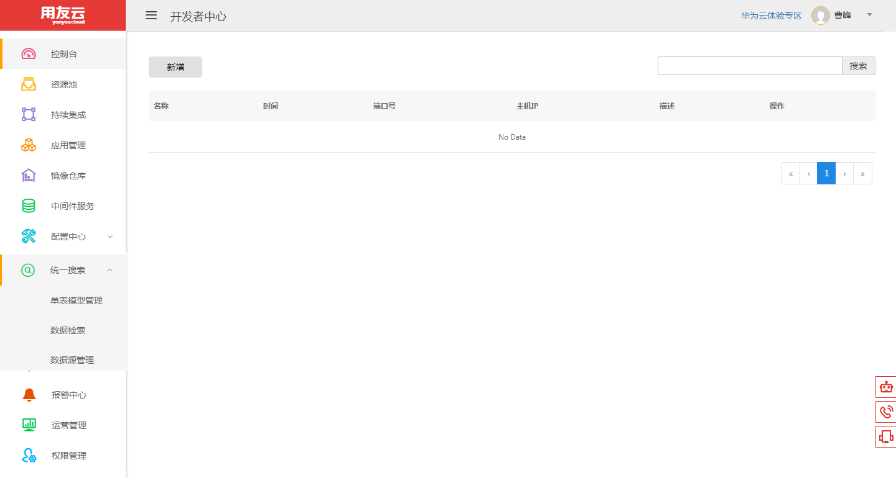
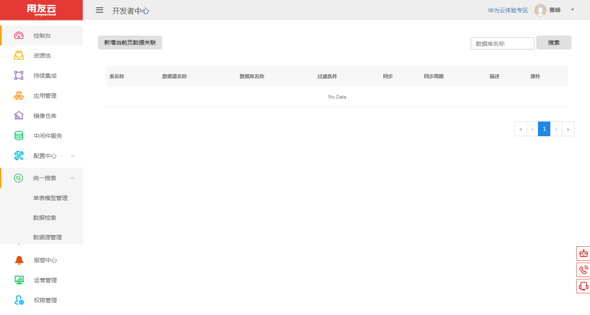
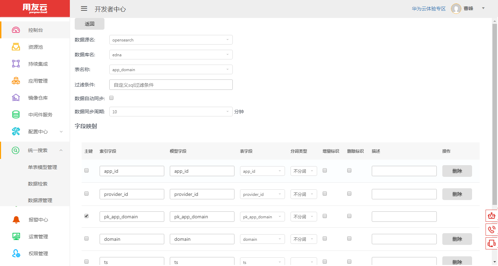
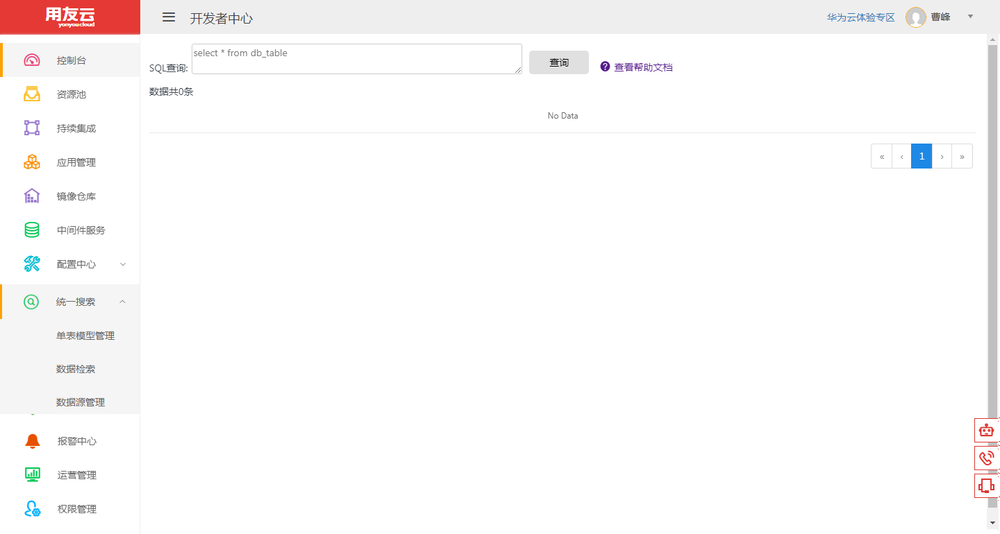

# 快速入门

第一步：登录云开发者中心网站：https://developer.yonyoucloud.com

第二步：点击"统一搜索-数据源管理"菜单,进入数据源管理界面。

第三步：输入数据源名称，IP或主机名，端口，只读权限的用户名、密码，创建数据源。

第四步：点击"统一搜索-单表模型管理"菜单,进入单表模型管理界面。

第五步：点击"新增当前页数据关联"按钮，选择数据源，数据库，表，过滤条件，数据自动同步，同步周期，以及字段映射关系，创建数据模型以及同步周期。

第六步：点击"统一搜索-数据检索"菜单,进入数据检索界面，可以根据类SQL语法查询数据。

统一搜索-数据检索的类SQL语法查询数据帮助文档：
<a href="/articles/cloud/3-/opensearch-help.md" title="帮助文档">查看帮助文档</a>

第七步：程序调用查询接口。
统一搜索服务作为一个微服务存在于开发者中心，具体接入流程请参考微服务接入手册。

