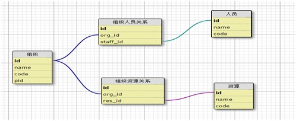
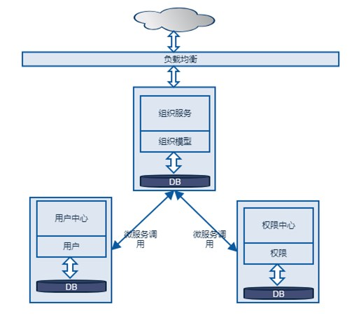
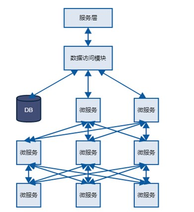
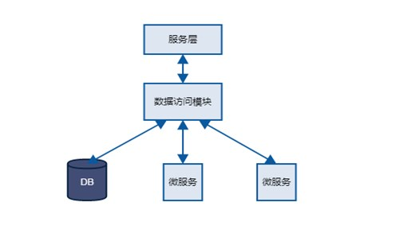
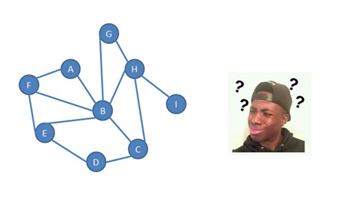
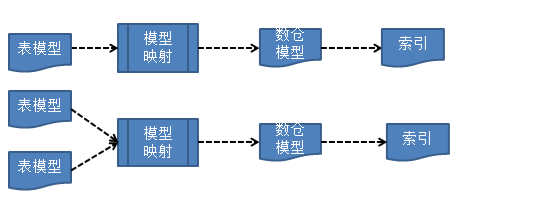
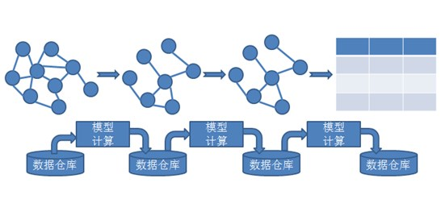

# 产品优势

微服务架构在云服务中应用的越来越广泛，常常会涉及到数据查询需要调用多个微服务的场景。如在组织结构服务中，执行对用户授权的业务操作，就需要调取用户中心服务的用户数据。
传统的数据库关系模型大致如下图：

但是在微服务应用架构下，管理员对该组织下人员授权，组织服务先从用户中心获取员工数据，再到权限中心对用户进行授权，调用关系如下：

在云服务中，随着业务发展，微服务数量和数据量会持续增加，一些问题会逐步的暴露：如核心应用的强依赖问题，数据孤岛问题，数据库性能问题等等。
 1. 服务的强依赖问题，微服务会解决单点问题，但是服务依赖是一个持久存在的问题：数据消费方需要向数据提供方获取数据，尽管这些数据只是辅助作用。如果这些服务之间出现网络抖动或者故障，会导致整个依赖链的服务出现不稳定甚至不可用。

 2. 数据孤岛问题，各个微服务的数据往往各自为政，但是又要相互协同，这使得服务层在处理业务逻辑的时候，数据访问层不仅仅针对数据库，还需要调用其他微服务来获取数据，数据孤岛使得各个微服务应用变得复杂而且相互依赖。

 3. 随着业务发展，模型复杂度的增加，数据量的增加，关系表模型变得越来越复杂，数据库性能也逐渐吃紧，数据量增加和模型复杂化使得数据库索引不再是解决查询性能问题的银弹。
 

统一搜索服务不同于简单的Solr Cloud或者Elasticsearch Cluster，相对比而言，有以下几大优势：
1. 数据模型自由定制：
数据结构计算模式有两种。
 - 同构数据，数据结构的计算由应用负责，数据结构托管到数据仓库。
 - 异构数据，应用自定义数据结构，数据结构计算由数据仓库负责，生成新的数据结构并提供检索能力。

2. 复杂网状模型扁平化，简化关系模型
  对于复杂关系模型的数据，通过数据仓库的分析计算，将网状模型转换为扁平模型，简化关系模型的同时，增加数据可读性，为数据可视化，数据分析做好基础。

3. 数据共享、数据安全
统一搜索服务收集各个微服务的基础数据，提供数据共享服务，解决了数据孤岛问题；同时，基于`RBAC`模型，精确到字段级别的权限控制，实现对数据调用的权限控制。数据授权使得各个微服务的数据数据能够做到安全可靠有选择性的共享。
4. 海量数据场景下快速、丰富的数据检索服务
  统一搜索服务使用索引检索技术，基于Lucene，提供快速、丰富的的数据检索能力。
  数据搜索能力包括但不限于：
  <table>
  <tr>
    <td>分词类型</td>
    <td>说明</td>
  </tr>
  <tr>
  <td>模糊分词</td>
    <td>类似于数据库的全模糊搜索，如果字段包含任何查询条件的内容，将返回该条记录</td>
  </tr>
  <tr>
  <td>前缀匹配</td>
    <td>类似于数据库的右模糊搜索，基于查询条件的前缀匹配 </td>
  </tr>
   <tr>
  <td>拼音分词</td>
    <td>支持简拼，全拼的模糊匹配分词 </td>
  </tr>
  <tr>
  <td>基于自然语义的中文分词</td>
    <td> 基于IK分词，适用于文章等内容检索 </td>
  </tr>
   <tr>
  <td>英文分词</td>
    <td> 基于英文模型的分词，能够根据标点符号，大小写，以及标签(#,@)来智能的分词 </td>
  </tr>
   <tr>
  <td>英文去词根分词</td>
    <td> 在英文分词的基础上，将复词转换为词根,如SF‘s,分词之后成为SF   </td>
  </tr>
</table>
 
统一搜索服务在各个应用数据隔离的场景下，提供了统一的数据托管服务，根据数据模型定义，对关系型复杂的数据进行简化处理，降低了应用获取数据的复杂度，提供了快速的检索服务。